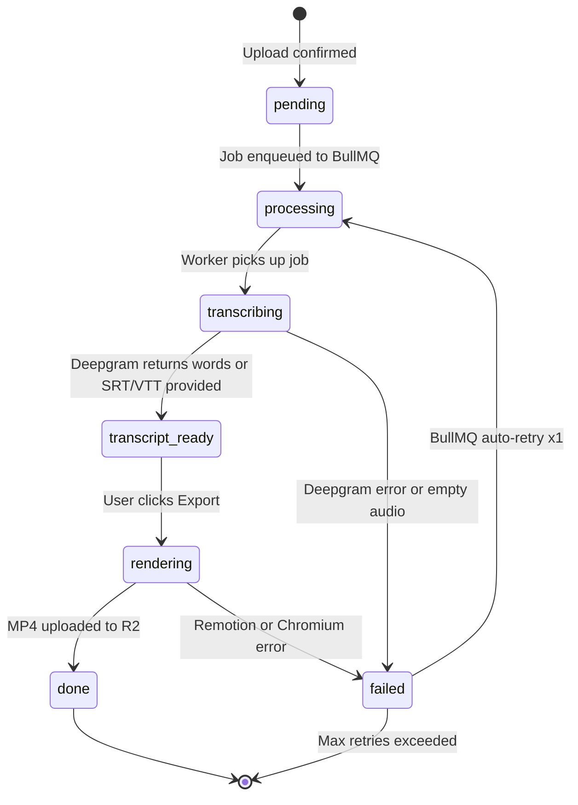
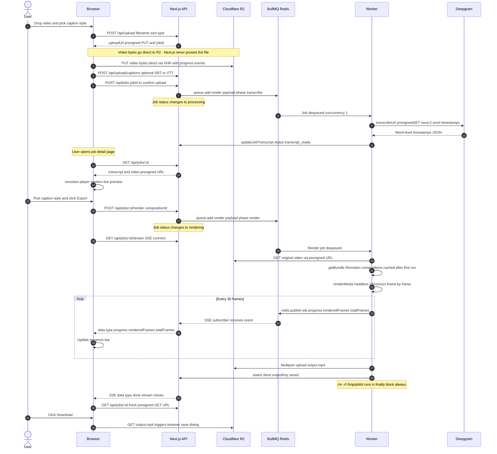

<div align="center">

<picture>
  <source media="(prefers-color-scheme: dark)" srcset="https://img.shields.io/badge/Instacap-000000?style=for-the-badge&logoColor=white">
  
</picture>

**Word-by-word animated captions for your videos**

Flat pricing · No credit system · Captions that are real React components

[](https://nextjs.org)
[](https://remotion.dev)
[](https://deepgram.com)
[](https://bullmq.io)
[](https://developers.cloudflare.com/r2)
[](https://mongodb.com)

</div>

---

## What it does

Upload a `.mp4` or `.mov`, choose a caption style, and get back a rendered video with frame-accurate animated captions. Deepgram Nova-2 handles AI transcription with word-level timestamps. Or skip AI entirely by uploading your own `.srt` / `.vtt` file. 11 caption styles — all real Remotion React components, not config-driven black boxes.

---

## Architecture

> **Interactive diagrams** — open [`docs/architecture.html`](docs/architecture.html) in a browser for a zoomable, pannable version with all three diagrams (Architecture · Job Status Flow · Sequence Diagram).

```mermaid
graph TB
    subgraph Browser["Browser"]
        UI["Upload Dropzone\n+ Style Picker"]
        Player["remotion/player\nLive Preview"]
        SSE_Client["EventSource\nProgress Stream"]
    end

    subgraph NextJS["Next.js App"]
        API_Upload["POST /api/upload\nPresigned PUT URL"]
        API_Captions["POST /api/upload/captions\nSRT / VTT Parser"]
        API_Jobs["POST /api/jobs\nConfirm Upload"]
        API_Enqueue["POST /api/jobs/:id/enqueue\nAdd to Queue"]
        API_Render["POST /api/jobs/:id/render\nTrigger Render"]
        API_Stream["GET /api/jobs/:id/stream\nSSE Endpoint"]
        API_Job["GET /api/jobs/:id\nStatus + Download URL"]
    end

    subgraph Worker["Node Worker - GCP VM"]
        BullWorker["BullMQ Consumer\nconcurrency = 1"]
        Transcribe["Transcribe Phase\nDeepgram Nova-2"]
        Render["Render Phase\nRemotion + Chromium"]
        Upload_Out["Upload Output\nMultipart to R2"]
    end

    subgraph Storage["Cloudflare R2"]
        Bucket_In["uploads/userId/jobId/video"]
        Bucket_Out["outputs/userId/jobId/output.mp4"]
        Bucket_Tr["transcripts/jobId/transcript.json"]
    end

    subgraph Data["Data Layer"]
        Mongo[("MongoDB Atlas\nJob + User docs")]
        Redis[("Upstash Redis\nQueue + Pub/Sub")]
    end

    UI -->|1 presign request| API_Upload
    API_Upload -->|2 presigned PUT URL| UI
    UI -->|3 PUT bytes direct| Bucket_In
    UI -->|4 optional SRT/VTT| API_Captions
    UI -->|5 confirm upload| API_Jobs
    API_Jobs -->|6 enqueue job| API_Enqueue
    API_Enqueue -->|add to queue| Redis
    BullWorker -->|dequeue| Redis
    BullWorker --> Transcribe
    Transcribe -->|presigned GET| Bucket_In
    Transcribe -->|store transcript| Mongo
    Transcribe -->|large transcripts| Bucket_Tr
    Transcribe -->|status transcript_ready| Mongo
    Player -->|load transcript| Mongo
    Player -->|presigned GET video| Bucket_In
    API_Render -->|re-enqueue render| Redis
    BullWorker --> Render
    Render -->|read transcript| Mongo
    Render -->|presigned GET video| Bucket_In
    Render -->|publish frame progress| Redis
    Render --> Upload_Out
    Upload_Out -->|multipart upload| Bucket_Out
    Upload_Out -->|status done| Mongo
    SSE_Client -->|connect| API_Stream
    API_Stream -->|subscribe pub/sub| Redis
    API_Stream -->|poll terminal status| Mongo
    API_Stream -->|frame events| SSE_Client
    UI -->|9 download click| API_Job
    API_Job -->|presigned GET URL| Bucket_Out

    style Browser fill:#1a1a2e,stroke:#6366f1,color:#e2e8f0
    style NextJS fill:#0f172a,stroke:#3b82f6,color:#e2e8f0
    style Worker fill:#1a0a00,stroke:#f97316,color:#e2e8f0
    style Storage fill:#0a1628,stroke:#f38020,color:#e2e8f0
    style Data fill:#0a1a0a,stroke:#22c55e,color:#e2e8f0
```



---

## Job Status Flow



---

## Core Pipeline — Step by Step



---

## Caption Styles

All 11 styles are Remotion React components in `/remotion/compositions/`. Every style accepts `{ transcript, videoSrc, activeColor, textColor, accentColor, fontFamily, watermark }` through the `CaptionRoot` dispatcher — the same props reach both the live preview and the worker render, so what you see is exactly what exports.

<table>
<tr><th>Style</th><th>Description</th></tr>
<tr><td><strong>Word by Word</strong></td><td>Active word highlights and scales up with a spring animation. Sliding window shows ±2–3 surrounding words.</td></tr>
<tr><td><strong>Karaoke</strong></td><td>Current segment on a dark pill. Past words dimmed, current word highlighted — teleprompter style.</td></tr>
<tr><td><strong>Fade</strong></td><td>Full segment text fades in at the start of each block. Clean and minimal.</td></tr>
<tr><td><strong>Spring</strong></td><td>Each word springs upward from below as it enters the visible window.</td></tr>
<tr><td><strong>Hype</strong></td><td>High-energy word-by-word with bold scaling and colour flash.</td></tr>
<tr><td><strong>Hormozi</strong></td><td>Large stacked caps inspired by Alex Hormozi's content style.</td></tr>
<tr><td><strong>Minimal</strong></td><td>Understated single-line captions, no animation noise.</td></tr>
<tr><td><strong>Box Highlight</strong></td><td>Active word gets a filled box behind it.</td></tr>
<tr><td><strong>Comic</strong></td><td>Speech-bubble style with chunky strokes.</td></tr>
<tr><td><strong>Pill</strong></td><td>Active word wrapped in a rounded pill badge.</td></tr>
<tr><td><strong>Script</strong></td><td>Flowing script-font style for lifestyle/vlog content.</td></tr>
</table>

`CaptionRoot` wraps all 11 and switches via a `style` prop — the `@remotion/player` reference stays stable while you swap styles without remounting.

---

## Project Structure

```
instacap/
├── app/                              # Next.js App Router — thin route files only
│   ├── api/
│   │   ├── upload/route.ts           # POST — presigned PUT URL + Job creation
│   │   ├── upload/captions/route.ts  # POST — parse SRT/VTT, store transcript
│   │   ├── jobs/route.ts             # POST confirm | GET list
│   │   ├── jobs/[id]/route.ts        # GET status + presigned download URL
│   │   ├── jobs/[id]/enqueue/        # POST — add to BullMQ queue
│   │   ├── jobs/[id]/render/         # POST — trigger render phase
│   │   ├── jobs/[id]/stream/         # GET — SSE progress stream
│   │   ├── billing/subscribe/        # POST — create Polar checkout session
│   │   ├── billing/portal/           # POST — Polar customer portal URL
│   │   ├── webhooks/clerk/           # Clerk user.created → MongoDB sync
│   │   └── webhooks/polar/           # Polar subscription.* events → sync User doc
│   ├── dashboard/                    # Upload UI + job grid
│   ├── dashboard/jobs/[id]/          # Job detail, preview, download
│   ├── dashboard/billing/            # Subscription status + upgrade UI
│   ├── dashboard/usage/              # Render usage this month
│   ├── page.tsx                      # Public landing page (SEO, pricing, style showcase)
│   ├── icon.tsx                      # Dynamic favicon
│   ├── opengraph-image.tsx           # OG image
│   ├── sitemap.ts                    # Auto-generated sitemap
│   └── robots.ts                     # robots.txt
│
├── src/                              # Shared logic (Next.js + worker both import this)
│   ├── controllers/                  # Request/response only — delegates to services
│   ├── services/
│   │   ├── upload.service.ts
│   │   ├── transcription.service.ts  # Deepgram/Whisper abstraction
│   │   ├── render.service.ts         # bundle() + cache
│   │   ├── job.service.ts
│   │   └── billing.service.ts        # Polar checkout, webhooks, canRender gate
│   ├── repositories/                 # DB access only — no business logic
│   ├── models/                       # Mongoose schemas (Job, User)
│   ├── lib/
│   │   ├── mongo.ts                  # Mongoose singleton
│   │   ├── redis.ts                  # ioredis singleton + pub/sub factory
│   │   ├── queue.ts                  # BullMQ queue definition
│   │   ├── storage.ts                # R2/S3 client singleton
│   │   ├── polar.ts                  # Polar SDK singleton
│   │   └── posthog.ts                # PostHog server-side singleton
│   ├── helpers/
│   │   ├── presigned-url.ts
│   │   ├── srt-parser.ts
│   │   ├── validators.ts
│   │   └── pricing-tiers.ts          # Single source of truth for pricing (landing, paywall, billing page)
│   └── types/                        # Shared TS types (Transcript, RenderJobPayload)
│
├── remotion/                         # Remotion compositions
│   ├── Root.tsx                      # registerRoot — all 11 compositions
│   ├── types.ts                      # Transcript types (duplicated — bundler isolation)
│   └── compositions/
│       ├── CaptionRoot.tsx           # Style-switching dispatcher (used by preview + worker)
│       ├── WordByWord.tsx
│       ├── Karaoke.tsx
│       ├── Fade.tsx
│       ├── Spring.tsx
│       ├── Hype.tsx
│       ├── Hormozi.tsx
│       ├── Minimal.tsx
│       ├── BoxHighlight.tsx
│       ├── Comic.tsx
│       ├── Pill.tsx
│       └── Script.tsx
│
├── worker/                           # Separate Node process — GCP VM
│   ├── index.ts                      # BullMQ Worker, SIGTERM graceful shutdown
│   └── render.ts                     # Two-phase: transcribe → transcript_ready → render → done
│
├── components/                       # Shared React UI
│   ├── upload-dropzone.tsx           # Video + SRT/VTT drop, style picker, upload flow
│   ├── preview-player-wrapper.tsx    # dynamic() ssr:false wrapper
│   ├── preview-player.tsx            # @remotion/player + style switcher + export
│   ├── job-progress.tsx              # SSE consumer, live progress bar
│   ├── download-button.tsx           # Fetches fresh presigned GET, browser download
│   ├── billing-actions.tsx           # Subscribe / cancel / portal buttons
│   ├── paywall-modal.tsx             # Shown when free render cap is hit
│   ├── posthog-identify.tsx          # Links Clerk userId to PostHog person on mount
│   ├── scroll-to-hash.tsx            # Smooth scroll for landing page anchor links
│   └── sidebar.tsx                   # Desktop nav + Clerk UserButton + plan badge
│
├── instrumentation-client.ts         # PostHog browser SDK init (Next.js instrumentation)
├── config/env.ts                     # Zod-validated env — fails loudly at startup
├── docs/vm-setup.md                  # GCP VM setup checklist
├── docker-compose.yml                # Local MongoDB + Redis
├── ecosystem.config.js               # pm2 config for Next.js + worker
└── proxy.ts                          # Clerk auth middleware (repo root)
```

---

## Data Types

The `Transcript` type is the **central contract** that locks every pipeline stage together. Deepgram adapter, SRT parser, and all four Remotion compositions produce or consume this exact shape.

```typescript
// src/types/transcript.types.ts
interface TranscriptWord {
  word: string
  start: number       // seconds (float)
  end: number         // seconds (float)
  confidence?: number
}

interface TranscriptSegment {
  text: string
  start: number
  end: number
  words: TranscriptWord[]
}

interface Transcript {
  source: 'deepgram' | 'user'
  language?: string
  segments: TranscriptSegment[]
  words: TranscriptWord[]   // flat list — primary input for word-by-word rendering
}
```

```typescript
// src/types/job.types.ts
interface RenderJobPayload {
  jobId: string
  userId: string
  videoKey: string
  transcriptKey?: string        // R2 key for large transcripts stored externally
  compositionId: 'WordByWord' | 'Karaoke' | 'Fade' | 'Spring' | 'Hype' | 'Hormozi' | 'Minimal' | 'BoxHighlight' | 'Comic' | 'Pill' | 'Script'
  fps: number
  outputFormat: 'mp4'
  phase: 'transcribe' | 'render'
  // Style customisation — passed through to CaptionRoot inputProps
  activeColor?: string          // colour of the highlighted/active word
  textColor?: string            // base word colour
  accentColor?: string          // secondary accent used by some styles
  fontFamily?: string           // override font (CSS font-family string)
  watermark?: boolean           // true on free-tier renders
}
```

---

## Environment Variables

Copy `.env.example` → `.env.local` and fill in all values.

| Variable | Description |
|---|---|
| `NEXT_PUBLIC_CLERK_PUBLISHABLE_KEY` | Clerk publishable key |
| `CLERK_SECRET_KEY` | Clerk secret key |
| `CLERK_WEBHOOK_SECRET` | Clerk webhook signing secret (`whsec_...`) |
| `MONGO_URI` | MongoDB Atlas connection string |
| `UPSTASH_REDIS_URL` | Upstash Redis URL (`rediss://...`) |
| `CLOUDFLARE_ACCOUNT_ID` | Cloudflare account ID (for R2 endpoint) |
| `R2_ACCESS_KEY_ID` | R2 API token access key |
| `R2_SECRET_ACCESS_KEY` | R2 API token secret |
| `R2_BUCKET_NAME` | R2 bucket name |
| `DEEPGRAM_API_KEY` | Deepgram API key |
| `TRANSCRIPTION_PROVIDER` | `deepgram` (default) or `whisper` (stub) |
| `POLAR_ACCESS_TOKEN` | Polar API access token |
| `POLAR_WEBHOOK_SECRET` | Polar webhook signing secret |
| `POLAR_PRODUCT_ID_WEEKLY` | Polar product ID for the weekly plan |
| `POLAR_PRODUCT_ID_MONTHLY` | Polar product ID for the monthly plan |
| `POLAR_PRODUCT_ID_YEARLY` | Polar product ID for the yearly plan |
| `POLAR_SERVER` | `sandbox` (default) or `production` |
| `NEXT_PUBLIC_APP_URL` | Full app URL, e.g. `https://instacap.com` (used for Polar redirect) |
| `NEXT_PUBLIC_POSTHOG_KEY` | PostHog project API key (`phc_...`) — optional, analytics disabled if absent |
| `NEXT_PUBLIC_POSTHOG_HOST` | PostHog ingest host, defaults to `https://us.i.posthog.com` |

> **Worker** reads from `worker/.env` — same variable names, no `NEXT_PUBLIC_*` vars needed.

> **R2 CORS** — configure a CORS policy on the R2 bucket allowing `PUT` and `Content-Type` from your app domain before presigned uploads will work.

> **Polar setup** — create three separate Products in Polar (Weekly / Monthly / Yearly), copy their IDs into env. Set `POLAR_SERVER=sandbox` for local testing, `production` when live.

---

## Local Development

### Prerequisites

- Node.js 20 LTS
- Docker (for MongoDB + Redis)

### Setup

```bash
# Install dependencies
npm install

# Start local MongoDB (port 27017) and Redis (port 6379)
docker-compose up -d

# Copy and fill in env vars
cp .env.example .env.local

# Start Next.js
npm run dev

# Start worker in a separate terminal
npm run worker:dev
```

### Remotion Studio

Develop and preview caption compositions in isolation with sample data:

```bash
npm run remotion:studio
```

All 4 compositions load with a hardcoded sample transcript. Use this to tune animation timing and style before connecting to real data.

---

## Worker Deployment (GCP VM)

Full step-by-step in [`docs/vm-setup.md`](docs/vm-setup.md). Quick summary:

```
1. Create VM: e2-standard-2, Ubuntu 22.04 LTS, 50 GB SSD
2. Install Chromium system deps + ffmpeg via apt
3. Install Node.js 20, pm2
4. Clone repo, npm install
5. Fill in worker/.env
6. npx tsc --project worker/tsconfig.json
7. pm2 start ecosystem.config.js && pm2 save
```

**Deploying updates:**

```bash
git pull origin main
npm install
npx tsc --project worker/tsconfig.json
pm2 restart caption-worker
```

**Disk cleanup** (if a crashed job left zombie `/tmp` dirs):

```bash
find /tmp -maxdepth 1 -name '[0-9a-f]*' -type d -mmin +60 -exec rm -rf {} +
```

---

## Key Implementation Notes

<details>
<summary><strong>Presigned uploads — why video never touches Next.js</strong></summary>

`POST /api/upload` returns a short-lived presigned S3 PUT URL. The client uploads video bytes directly to R2 using `XMLHttpRequest` (not `fetch`, so we get upload progress events). Next.js never proxies the file body — keeping serverless function memory usage at near zero regardless of file size.

</details>

<details>
<summary><strong>Remotion bundle caching</strong></summary>

`render.service.ts` stores the Remotion bundle URL in a module-level variable (`let bundleCache`). `bundle()` takes 10–30 seconds the first time; subsequent jobs on the same worker process reuse the cached serve URL. This is safe because compositions don't change between job runs without a worker restart.

</details>

<details>
<summary><strong>Transcript storage strategy</strong></summary>

Transcripts are stored inline on the Job document as a `Schema.Types.Mixed` field (not `Map` — Mongoose Map fields serialize oddly). For transcripts with many words (long videos), they are stored as JSON in R2 at `transcripts/{jobId}/transcript.json` and referenced via `transcriptKey`. Always serialized through `JSON.parse(JSON.stringify(...))` before writing to strip non-serializable objects from the Deepgram SDK response.

</details>

<details>
<summary><strong>SSE + dedicated Redis pub/sub connection</strong></summary>

The SSE route opens a **separate** ioredis connection in `SUBSCRIBE` mode via `createRedisSub()`. Connections in subscribe mode cannot execute other Redis commands, so this must be isolated from the main singleton. The route also polls MongoDB every 2 seconds for terminal status (`done` / `failed`) and closes the stream when reached, with a hard 10-minute timeout as a safety net.

</details>

<details>
<summary><strong>Worker concurrency</strong></summary>

The worker runs at `concurrency: 1` — one render at a time. Remotion's headless Chromium render is memory-intensive. Running parallel renders on a standard `e2-standard-2` VM (8 GB RAM) would exhaust memory. Revisit if queue wait times become a problem by either increasing VM size or running multiple worker processes.

</details>

<details>
<summary><strong>SRT parsing fallback</strong></summary>

SRT files have block-level timing only — no word-level timestamps. Each block is mapped to a single `TranscriptWord` where `word = full line text`. The `WordByWord` and `Karaoke` compositions handle this gracefully — when a "word" spans multiple seconds, the highlight stays on it for the full duration.

</details>

<details>
<summary><strong>Clerk middleware placement</strong></summary>

`proxy.ts` lives at the **repo root**, not inside `/app`. This is required by Next.js — middleware must be at the root or `src/` level to run before the App Router. All SSE and webhook routes export `export const runtime = 'nodejs'` to prevent Vercel from routing them to the Edge Runtime (ioredis requires TCP, not HTTP, and fails silently on Edge).

</details>

<details>
<summary><strong>Polar billing — why no local payment state</strong></summary>

Polar's checkout is hosted — there's no subscription to reference locally until the customer completes payment. `createCheckout()` sets `externalCustomerId: clerkId` so Polar's `subscription.*` webhook can map back to the right user without any intermediate state. The app never stores card numbers, invoice amounts, or payment methods — all of that lives in Polar. `cancelAtPeriodEnd: true` is used for cancellations so the user keeps paid access through their current cycle; the local `subscriptionStatus` is only updated when Polar fires the next webhook confirming the period actually ended.

</details>

<details>
<summary><strong>PostHog — server-side vs client-side</strong></summary>

Two separate PostHog integrations run in parallel. The browser SDK (`instrumentation-client.ts`) is initialised via Next.js instrumentation and routes through `/ingest/*` (a rewrite in `next.config.ts`) rather than directly to `i.posthog.com` — this keeps requests on the same origin so ad-blockers (Brave, uBlock) don't drop them. The server-side SDK (`src/lib/posthog.ts`) captures backend events like `checkout_started` and `subscription_active` using the same Clerk `userId` as the `distinctId`, so both sides merge into one person in PostHog. The server client is optional — if `NEXT_PUBLIC_POSTHOG_KEY` is not set, `getPostHog()` returns `null` and all capture calls are no-ops.

</details>

<details>
<summary><strong>Render customisation props</strong></summary>

Style-specific props (`activeColor`, `textColor`, `accentColor`, `fontFamily`, `watermark`) are passed through `RenderJobPayload` to the worker and forwarded as `inputProps` to `CaptionRoot`. This is the same component the live preview uses — wiring props through `CaptionRoot` rather than selecting composition styles directly means the worker and preview cannot silently diverge on which props each receives.

</details>

<details>
<summary><strong>Render performance — CRF and concurrency</strong></summary>

The worker renders with `crf: 22` (H.264) and `concurrency: os.cpus().length`. CRF 22 is visually high quality for web/social while producing smaller files faster than the previous CRF 18. Full CPU concurrency replaces the old hardcoded `1` — Remotion parallelises frame rendering across all available cores, which significantly cuts render time on multi-core VMs.

</details>

---

## Tech Stack

| | Technology | Why |
|---|---|---|
| **Framework** | Next.js 16 (App Router) | Server components, API routes, streaming |
| **UI** | Tailwind CSS v4 + shadcn/ui | Utility-first, accessible primitives |
| **Auth** | Clerk | Google OAuth, webhooks, middleware in one |
| **Database** | MongoDB + Mongoose | Flexible schema for transcript Mixed field |
| **Storage** | Cloudflare R2 | S3-compatible, zero egress fees |
| **Queue** | BullMQ + Upstash Redis | Reliable job queue, pub/sub for SSE |
| **Transcription** | Deepgram Nova-2 | Word-level timestamps, fast batch API |
| **Rendering** | Remotion 4 | React-based video rendering, headless Chromium |
| **Preview** | `@remotion/player` | Real-time in-browser composition preview |
| **Billing** | Polar | Subscription checkout, webhooks, customer portal |
| **Analytics** | PostHog | Event capture, session replay, funnel analysis |
| **Data fetching** | TanStack Query v5 | Mutations for upload flow |
| **Validation** | Zod | Request validation + env schema |
| **Worker runtime** | Node.js + pm2 | Long-running process, GCP VM |

---

## Pricing

| Plan | Price | Renders | Watermark |
|---|---|---|---|
| Free | $0 | 3 / month | Yes |
| Weekly | $6.99 / week | Unlimited | No |
| Monthly | $14.99 / month | Unlimited | No |
| Yearly | $119 / year (~$9.92/mo) | Unlimited | No |

Free-tier renders are watermarked. A paywall modal is shown when the monthly cap is hit. `bonusRenders` field on the User doc lets you manually grant extra free renders (beta testers, support gestures) without touching billing.

Billing is handled entirely by **Polar** — checkout sessions, subscription lifecycle, and the customer portal (invoices + payment method management) are all Polar-hosted. The app receives `subscription.*` webhooks and syncs `polarSubscriptionId`, `subscriptionStatus`, and `billingTier` onto the User document. No payment data is stored locally.

---

## Product Limits

| Constraint | Value |
|---|---|
| Max file size | 500 MB |
| Accepted formats | MP4, MOV |
| Daily uploads (free tier) | 5 per user |
| Free renders per month | 3 (+ any bonus renders granted) |
| Render concurrency | 1 (single worker) |
| Storage retention | 7 days |
| BullMQ retry on failure | 1 automatic retry |
| SSE stream max duration | 10 minutes |

---

## Scripts

```bash
npm run dev              # Next.js development server
npm run build            # Production build
npm run start            # Production server
npm run lint             # ESLint
npm run worker:dev       # Worker with tsx + .env.local (development)
npm run remotion:studio  # Remotion Studio for composition development
```

---

## Roadmap

**Shipped (Phase 2)**
- Polar billing — Weekly / Monthly / Yearly subscriptions, customer portal
- Watermarked free-tier renders with paywall modal
- 11 caption styles (up from 4)
- PostHog analytics (browser + server-side)
- Landing page with pricing, style showcase, SEO metadata

**Up next (Phase 3)**
- Brand kit — saved colour / font / animation presets per user
- Batch upload (multiple videos per job)
- Improved retry UI for failed renders
- Public REST API exposing Remotion compositions programmatically
- Multi-worker scaling (multiple VM instances)
- Multi-speaker diarization (podcast use case)
