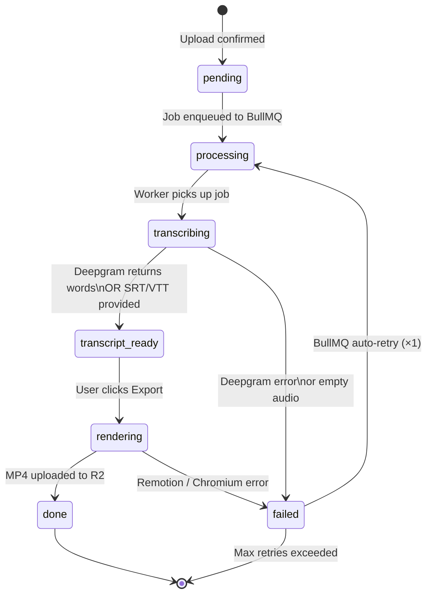
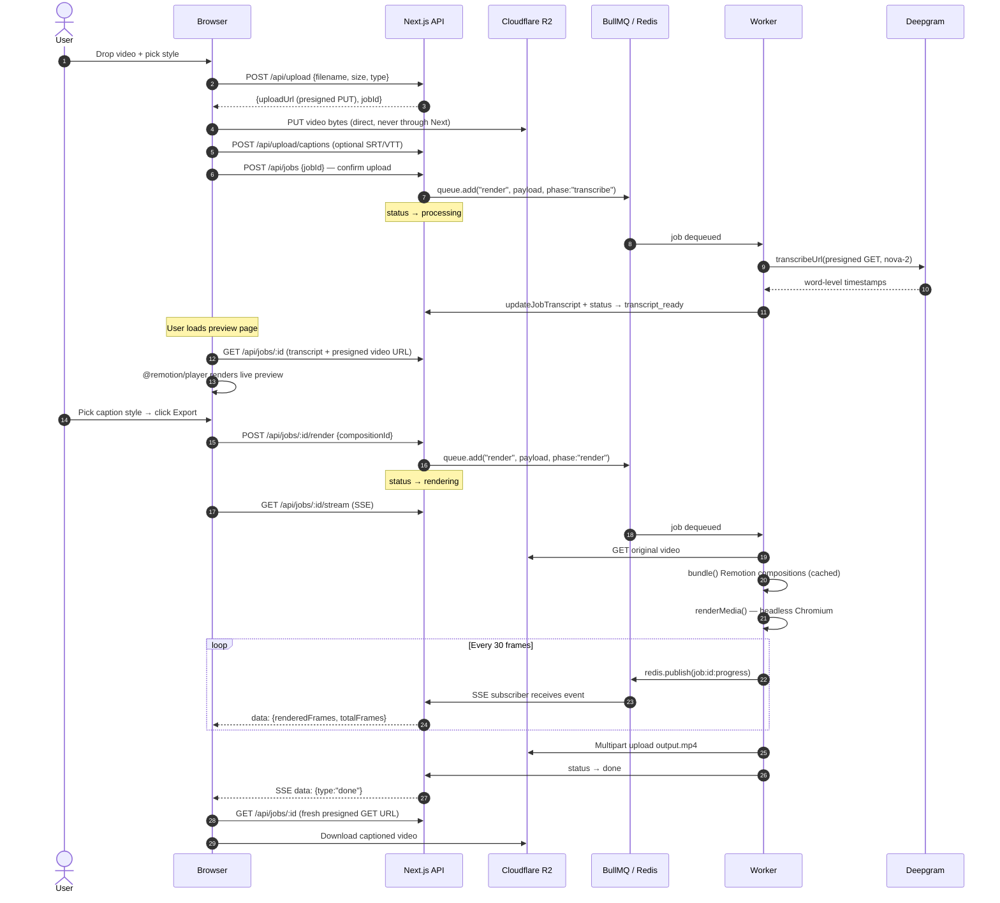

<div align="center">

<picture>
  <source media="(prefers-color-scheme: dark)" srcset="https://img.shields.io/badge/Captions-000000?style=for-the-badge&logoColor=white">
  
</picture>

**Word-by-word animated captions for your videos**

Flat pricing · No credit system · Captions that are real React components

[](https://nextjs.org)
[](https://remotion.dev)
[](https://deepgram.com)
[](https://bullmq.io)
[](https://developers.cloudflare.com/r2)
[](https://mongodb.com)

</div>

---

## What it does

Upload a `.mp4` or `.mov`, choose a caption style, and get back a rendered video with frame-accurate animated captions. Deepgram Nova-2 handles AI transcription with word-level timestamps. Or skip AI entirely by uploading your own `.srt` / `.vtt` file. Four caption styles — all real Remotion React components, not config-driven black boxes.

---

## Architecture

> **Interactive diagrams** — open [`docs/architecture.html`](docs/architecture.html) in a browser for a zoomable, pannable version with all three diagrams (Architecture · Job Status Flow · Sequence Diagram).

```mermaid
graph TB
    subgraph Browser["🌐 Browser"]
        direction TB
        UI["Upload Dropzone\n+ Style Picker"]
        Player["@remotion/player\nLive Preview"]
        SSE_Client["EventSource\nProgress Stream"]
    end

    subgraph NextJS["⚡ Next.js App  (Vercel / GCP VM)"]
        direction TB
        API_Upload["POST /api/upload\nPresigned PUT URL"]
        API_Captions["POST /api/upload/captions\nSRT / VTT Parser"]
        API_Jobs["POST /api/jobs\nConfirm Upload"]
        API_Enqueue["POST /api/jobs/:id/enqueue\nAdd to Queue"]
        API_Render["POST /api/jobs/:id/render\nTrigger Render Phase"]
        API_Stream["GET /api/jobs/:id/stream\nSSE Endpoint"]
        API_Job["GET /api/jobs/:id\nStatus + Download URL"]
    end

    subgraph Worker["🖥️ Node Worker  (GCP VM · pm2)"]
        direction TB
        BullWorker["BullMQ Consumer\nconcurrency = 1"]
        Transcribe["Transcribe Phase\nDeepgram Nova-2"]
        Render["Render Phase\nRemotion + Chromium"]
        Upload_Out["Upload Output\nto R2 via Multipart"]
    end

    subgraph Storage["☁️ Cloudflare R2"]
        Bucket_In["uploads/\n{userId}/{jobId}/video"]
        Bucket_Out["outputs/\n{userId}/{jobId}/output.mp4"]
        Bucket_Tr["transcripts/\n{jobId}/transcript.json"]
    end

    subgraph Data["🗄️ Data Layer"]
        Mongo[("MongoDB Atlas\nJob + User docs")]
        Redis[("Upstash Redis\nBullMQ Queue\n+ Pub/Sub")]
    end

    UI -->|"1 · presign request"| API_Upload
    API_Upload -->|"2 · presigned PUT URL"| UI
    UI -->|"3 · PUT bytes direct"| Bucket_In
    UI -->|"4 · optional SRT/VTT"| API_Captions
    UI -->|"5 · confirm upload"| API_Jobs
    API_Jobs -->|enqueue transcribe"| API_Enqueue
    API_Enqueue -->|"add job"| Redis
    BullWorker -->|"pick up job"| Redis
    BullWorker --> Transcribe
    Transcribe -->|"presigned GET"| Bucket_In
    Transcribe -->|"store transcript"| Mongo
    Transcribe -->|"large transcripts"| Bucket_Tr
    Transcribe -->|"status → transcript_ready"| Mongo
    Player -->|"load transcript + video"| Mongo
    Player -->|"presigned GET"| Bucket_In
    API_Render -->|"re-enqueue render phase"| Redis
    BullWorker --> Render
    Render -->|"read transcript"| Mongo
    Render -->|"presigned GET video"| Bucket_In
    Render -->|"publish frame progress"| Redis
    Render --> Upload_Out
    Upload_Out -->|"multipart upload"| Bucket_Out
    Upload_Out -->|"status → done"| Mongo
    SSE_Client -->|"connect"| API_Stream
    API_Stream -->|"subscribe pub/sub"| Redis
    API_Stream -->|"poll terminal status"| Mongo
    API_Stream -->|"frame events"| SSE_Client
    UI -->|"download click"| API_Job
    API_Job -->|"presigned GET"| Bucket_Out

    style Browser fill:#1a1a2e,stroke:#6366f1,color:#e2e8f0
    style NextJS fill:#0f172a,stroke:#3b82f6,color:#e2e8f0
    style Worker fill:#1a0a00,stroke:#f97316,color:#e2e8f0
    style Storage fill:#0a1628,stroke:#f38020,color:#e2e8f0
    style Data fill:#0a1a0a,stroke:#22c55e,color:#e2e8f0
```

---

## Job Status Flow



---

## Core Pipeline — Step by Step



---

## Caption Styles

All four styles are Remotion React components in `/remotion/compositions/`. Each accepts `{ transcript: Transcript, videoSrc: string }`.

<table>
<tr>
<th width="25%">Word by Word</th>
<th width="25%">Karaoke</th>
<th width="25%">Fade</th>
<th width="25%">Spring</th>
</tr>
<tr>
<td>

Active word highlights in **yellow** and scales up with a spring animation. A sliding window (±2–3 words) keeps context visible.

```
the quick [BROWN] fox
```
</td>
<td>

Shows the current **segment** on a dark pill background. Past words are dimmed, the current word is yellow — like a karaoke teleprompter.

```
past · [NOW] · future
```
</td>
<td>

Full segment text **fades in** at the start of each block. Clean and minimal — no per-word tracking needed.

```
Line fades in smoothly…
```
</td>
<td>

Each word **springs upward** from below as it enters the visible window. Uses Remotion's spring physics.

```
Words ↑ bounce ↑ into ↑ view
```
</td>
</tr>
</table>

The `CaptionRoot` composition wraps all four and switches between them via a `style` prop — the `@remotion/player` reference stays stable while you swap styles without remounting.

---

## Project Structure

```
captions/
├── app/                              # Next.js App Router — thin route files only
│   ├── api/
│   │   ├── upload/route.ts           # POST — presigned PUT URL + Job creation
│   │   ├── upload/captions/route.ts  # POST — parse SRT/VTT, store transcript
│   │   ├── jobs/route.ts             # POST confirm | GET list
│   │   ├── jobs/[id]/route.ts        # GET status + presigned download URL
│   │   ├── jobs/[id]/enqueue/        # POST — add to BullMQ queue
│   │   ├── jobs/[id]/render/         # POST — trigger render phase
│   │   ├── jobs/[id]/stream/         # GET — SSE progress stream
│   │   └── webhooks/clerk/           # Clerk user.created → MongoDB sync
│   ├── dashboard/                    # Upload UI + job grid
│   └── dashboard/jobs/[id]/          # Job detail, preview, download
│
├── src/                              # Shared logic (Next.js + worker both import this)
│   ├── controllers/                  # Request/response only — delegates to services
│   ├── services/                     # Business logic (upload, transcription, render, job)
│   ├── repositories/                 # DB access only — no business logic
│   ├── models/                       # Mongoose schemas (Job, User)
│   ├── lib/                          # Singleton clients (mongo, redis, queue, storage)
│   ├── helpers/                      # Pure utilities (presigned URLs, SRT parser, validators)
│   └── types/                        # Shared TS types (Transcript, RenderJobPayload)
│
├── remotion/                         # Remotion compositions
│   ├── Root.tsx                      # registerRoot — all 4 compositions
│   ├── types.ts                      # Transcript types (duplicated from src — bundler isolation)
│   └── compositions/
│       ├── CaptionRoot.tsx           # Style-switching wrapper
│       ├── WordByWord.tsx
│       ├── Karaoke.tsx
│       ├── Fade.tsx
│       └── Spring.tsx
│
├── worker/                           # Separate Node process — GCP VM
│   ├── index.ts                      # BullMQ Worker, SIGTERM graceful shutdown
│   └── render.ts                     # Two-phase: transcribe → transcript_ready → render → done
│
├── components/                       # Shared React UI
│   ├── upload-dropzone.tsx           # Video + SRT/VTT drop, style picker, upload flow
│   ├── preview-player-wrapper.tsx    # dynamic() ssr:false wrapper
│   ├── preview-player.tsx            # @remotion/player + style switcher + export
│   ├── job-progress.tsx              # SSE consumer, live progress bar
│   ├── download-button.tsx           # Fetches fresh presigned GET, browser download
│   └── sidebar.tsx                   # Desktop nav + Clerk UserButton
│
├── config/env.ts                     # Zod-validated env — fails loudly at startup
├── docs/vm-setup.md                  # GCP VM setup checklist
├── docker-compose.yml                # Local MongoDB + Redis
├── ecosystem.config.js               # pm2 config for the worker
└── proxy.ts                          # Clerk auth middleware (repo root)
```

---

## Data Types

The `Transcript` type is the **central contract** that locks every pipeline stage together. Deepgram adapter, SRT parser, and all four Remotion compositions produce or consume this exact shape.

```typescript
// src/types/transcript.types.ts
interface TranscriptWord {
  word: string
  start: number       // seconds (float)
  end: number         // seconds (float)
  confidence?: number
}

interface TranscriptSegment {
  text: string
  start: number
  end: number
  words: TranscriptWord[]
}

interface Transcript {
  source: 'deepgram' | 'user'
  language?: string
  segments: TranscriptSegment[]
  words: TranscriptWord[]   // flat list — primary input for word-by-word rendering
}
```

```typescript
// src/types/job.types.ts
interface RenderJobPayload {
  jobId: string
  userId: string
  videoKey: string
  transcriptKey?: string   // R2 key for large transcripts stored externally
  compositionId: 'WordByWord' | 'Karaoke' | 'Fade' | 'Spring'
  fps: number
  outputFormat: 'mp4'
  phase: 'transcribe' | 'render'
}
```

---

## Environment Variables

Copy `.env.example` → `.env.local` and fill in all values.

| Variable | Description |
|---|---|
| `NEXT_PUBLIC_CLERK_PUBLISHABLE_KEY` | Clerk publishable key |
| `CLERK_SECRET_KEY` | Clerk secret key |
| `CLERK_WEBHOOK_SECRET` | Clerk webhook signing secret (`whsec_...`) |
| `MONGO_URI` | MongoDB Atlas connection string |
| `UPSTASH_REDIS_URL` | Upstash Redis URL (`rediss://...`) |
| `CLOUDFLARE_ACCOUNT_ID` | Cloudflare account ID (for R2 endpoint) |
| `R2_ACCESS_KEY_ID` | R2 API token access key |
| `R2_SECRET_ACCESS_KEY` | R2 API token secret |
| `R2_BUCKET_NAME` | R2 bucket name (e.g. `captions`) |
| `DEEPGRAM_API_KEY` | Deepgram API key |
| `TRANSCRIPTION_PROVIDER` | `deepgram` (default) or `whisper` (stub) |

> **Worker** reads from `worker/.env` — same variable names, no `NEXT_PUBLIC_*` vars needed.

> **R2 CORS** — you must configure a CORS policy on the R2 bucket allowing `PUT` and `Content-Type` from your app domain before presigned uploads will work.

---

## Local Development

### Prerequisites

- Node.js 20 LTS
- Docker (for MongoDB + Redis)

### Setup

```bash
# Install dependencies
npm install

# Start local MongoDB (port 27017) and Redis (port 6379)
docker-compose up -d

# Copy and fill in env vars
cp .env.example .env.local

# Start Next.js
npm run dev

# Start worker in a separate terminal
npm run worker:dev
```

### Remotion Studio

Develop and preview caption compositions in isolation with sample data:

```bash
npm run remotion:studio
```

All 4 compositions load with a hardcoded sample transcript. Use this to tune animation timing and style before connecting to real data.

---

## Worker Deployment (GCP VM)

Full step-by-step in [`docs/vm-setup.md`](docs/vm-setup.md). Quick summary:

```
1. Create VM: e2-standard-2, Ubuntu 22.04 LTS, 50 GB SSD
2. Install Chromium system deps + ffmpeg via apt
3. Install Node.js 20, pm2
4. Clone repo, npm install
5. Fill in worker/.env
6. npx tsc --project worker/tsconfig.json
7. pm2 start ecosystem.config.js && pm2 save
```

**Deploying updates:**

```bash
git pull origin main
npm install
npx tsc --project worker/tsconfig.json
pm2 restart caption-worker
```

**Disk cleanup** (if a crashed job left zombie `/tmp` dirs):

```bash
find /tmp -maxdepth 1 -name '[0-9a-f]*' -type d -mmin +60 -exec rm -rf {} +
```

---

## Key Implementation Notes

<details>
<summary><strong>Presigned uploads — why video never touches Next.js</strong></summary>

`POST /api/upload` returns a short-lived presigned S3 PUT URL. The client uploads video bytes directly to R2 using `XMLHttpRequest` (not `fetch`, so we get upload progress events). Next.js never proxies the file body — keeping serverless function memory usage at near zero regardless of file size.

</details>

<details>
<summary><strong>Remotion bundle caching</strong></summary>

`render.service.ts` stores the Remotion bundle URL in a module-level variable (`let bundleCache`). `bundle()` takes 10–30 seconds the first time; subsequent jobs on the same worker process reuse the cached serve URL. This is safe because compositions don't change between job runs without a worker restart.

</details>

<details>
<summary><strong>Transcript storage strategy</strong></summary>

Transcripts are stored inline on the Job document as a `Schema.Types.Mixed` field (not `Map` — Mongoose Map fields serialize oddly). For transcripts with many words (long videos), they are stored as JSON in R2 at `transcripts/{jobId}/transcript.json` and referenced via `transcriptKey`. Always serialized through `JSON.parse(JSON.stringify(...))` before writing to strip non-serializable objects from the Deepgram SDK response.

</details>

<details>
<summary><strong>SSE + dedicated Redis pub/sub connection</strong></summary>

The SSE route opens a **separate** ioredis connection in `SUBSCRIBE` mode via `createRedisSub()`. Connections in subscribe mode cannot execute other Redis commands, so this must be isolated from the main singleton. The route also polls MongoDB every 2 seconds for terminal status (`done` / `failed`) and closes the stream when reached, with a hard 10-minute timeout as a safety net.

</details>

<details>
<summary><strong>Worker concurrency</strong></summary>

The worker runs at `concurrency: 1` — one render at a time. Remotion's headless Chromium render is memory-intensive. Running parallel renders on a standard `e2-standard-2` VM (8 GB RAM) would exhaust memory. Revisit if queue wait times become a problem by either increasing VM size or running multiple worker processes.

</details>

<details>
<summary><strong>SRT parsing fallback</strong></summary>

SRT files have block-level timing only — no word-level timestamps. Each block is mapped to a single `TranscriptWord` where `word = full line text`. The `WordByWord` and `Karaoke` compositions handle this gracefully — when a "word" spans multiple seconds, the highlight stays on it for the full duration.

</details>

<details>
<summary><strong>Clerk middleware placement</strong></summary>

`proxy.ts` lives at the **repo root**, not inside `/app`. This is required by Next.js — middleware must be at the root or `src/` level to run before the App Router. All SSE and webhook routes export `export const runtime = 'nodejs'` to prevent Vercel from routing them to the Edge Runtime (ioredis requires TCP, not HTTP, and fails silently on Edge).

</details>

---

## Tech Stack

| | Technology | Why |
|---|---|---|
| **Framework** | Next.js 16 (App Router) | Server components, API routes, streaming |
| **UI** | Tailwind CSS v4 + shadcn/ui | Utility-first, accessible primitives |
| **Auth** | Clerk | Google OAuth, webhooks, middleware in one |
| **Database** | MongoDB + Mongoose | Flexible schema for transcript Mixed field |
| **Storage** | Cloudflare R2 | S3-compatible, zero egress fees |
| **Queue** | BullMQ + Upstash Redis | Reliable job queue, pub/sub for SSE |
| **Transcription** | Deepgram Nova-2 | Word-level timestamps, fast batch API |
| **Rendering** | Remotion 4 | React-based video rendering, headless Chromium |
| **Preview** | `@remotion/player` | Real-time in-browser composition preview |
| **Data fetching** | TanStack Query v5 | Mutations for upload flow |
| **Validation** | Zod | Request validation + env schema |
| **Worker runtime** | Node.js + pm2 | Long-running process, GCP VM |

---

## Product Limits (MVP)

| Constraint | Value |
|---|---|
| Max file size | 500 MB |
| Accepted formats | MP4, MOV |
| Daily uploads (free tier) | 5 per user |
| Render concurrency | 1 (single worker) |
| Storage retention | 7 days |
| BullMQ retry on failure | 1 automatic retry |
| SSE stream max duration | 10 minutes |

---

## Scripts

```bash
npm run dev              # Next.js development server
npm run build            # Production build
npm run start            # Production server
npm run lint             # ESLint
npm run worker:dev       # Worker with tsx + .env.local (development)
npm run remotion:studio  # Remotion Studio for composition development
```

---

## Roadmap

**Phase 2 — Payments + polish**
- Stripe Checkout + webhooks (flat monthly tier, no credit system)
- Brand kit: saved font / color / animation presets per user
- Batch upload (multiple videos per job)
- Better retry UI for failed renders
- Usage dashboard (renders done, storage used)

**Phase 3 — Scale + API**
- Public REST API exposing Remotion compositions programmatically
- Multi-worker scaling (multiple VM instances)
- Additional caption styles and per-style customization controls
- Multi-speaker diarization (podcast use case)
